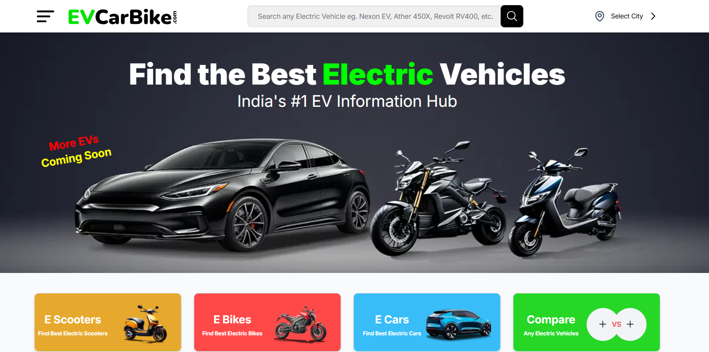
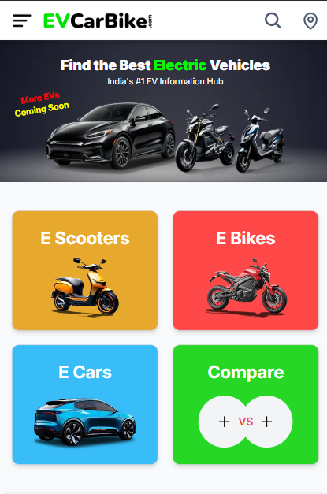

# Hi, I'm Maninder Singh 👋

I'm a **Full Stack Engineer** passionate about building modern, responsive, and impactful web applications. I enjoy turning ideas into digital products using technologies like **React.js**, **Next.js**, **Node.js**, and more. My focus is always on creating smooth user experiences and scalable solutions.

📧 **Email**: [ms1920af2@gmail.com](mailto:ms1920af2@gmail.com)
💼 **Open to Hire**: Actively seeking opportunities to collaborate on exciting projects or join innovative teams.

---

## 🚀 Featured Projects

### 1. **EVCarBike.com**

🔗 **Live Link**: [EVCarBike.com](https://www.evcarbike.com/)

**EVCarBike** is a platform dedicated to Indian electric vehicles:

* Offers **detailed EV information** including city-specific prices, specifications, colors, and features.
* Powerful **search and comparison tools** for better decision-making.
* Built to support India’s growing EV ecosystem.

#### Homepage Screenshots

* **Desktop View**
  

* **Mobile View**
  

---

## 🛠️ Skills & Technologies

* **Frontend**: React.js, Next.js, TypeScript, JavaScript
* **Backend**: Node.js, Express.js
* **Database**: PostgreSQL, MongoDB
* **Other**: Java, DSA, C++, Python, REST APIs, Blockchain, Web3, AWS

---

✨ Always open to collaborations, innovative projects, and meaningful tech conversations!
